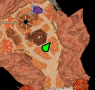
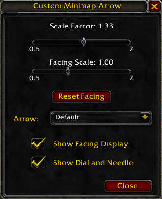

# Custom Minimap Arrow Addon for World of Warcraft

## *Example of a Custom Arrow in Use*

## *Customization Panel*

## Overview
This addon allows players to customize the appearance of their minimap arrow in World of Warcraft. With a variety of arrow styles to choose from, players can personalize their UI to better match their individual preferences.

## Features
- Scale Adjustment: Dynamically adjust the size of your minimap arrow.
- Custom Arrow Replacement: Change the default minimap arrow with a selection of custom arrow designs.
- Facing Display: A movable frame that shows your character's facing direction in degrees, like a compass.
- Dial and Needle: Adds a dial and needle overlay on the minimap to visually represent your facing direction.

## Installation
1. Download the addon.
2. Unzip and copy `CustomMinimapArrow` folder into the World of Warcraft `Interface\AddOns` folder.
3. Restart World of Warcraft or reload your UI.

## Usage
- Open with `/cma` command.
- Adjust the scale of the minimap arrow.
- Choose from a variety of arrow designs.
- Toggle the facing display on or off.
- Reposition the facing display with X and Y position sliders.
- Show/Hide the dial and needle overlay on the minimap.

## Support and Community

If you need help or have questions about this application, the best way to get support is by joining the Discord.

To join the Discord, click on this invite link: [Discord](https://discord.com/invite/aP9CjWE)

## Support and Donations

If you enjoy using this project and find it helpful, please consider supporting its development. Your support helps to ensure the project's continued development, bug fixes, and improvements.

### Other Ways to Support

- Share this project.
- Report any issues you encounter or suggest new features and improvements by creating a new issue on the GitHub repository.
- Contribute to the project by submitting pull requests with bug fixes, new features, or improvements to the code or documentation.
- Star the repository on GitHub to show your appreciation for the project.

### Donations

If you would like to make a financial contribution to support development, you can donate using the following method:

- [Ko-fi](https://ko-fi.com/AAxBattery)

Your donation, no matter the size, is greatly appreciated and will help to support future development and maintenance. Thank you for your generosity!